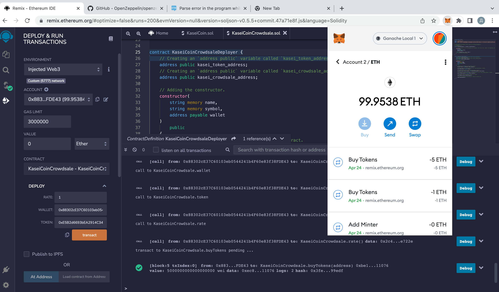

# Token-Crowdsale

# Description

 In this project, I am developing a monetary system for a new Mars colony by creating a KaseiCoin token contract, a KaseiCoin crowdsale contract and a KaseiCoin deployer contract. FTo test this contract, I have deployed it on a local blockchain via Ganache. KaseiCoin is a fungible token and is ERC-20 compliant. The goal of this crowdsale is for people moving to Mars to convert earthling money to KaseiCoin.

# Evaluation Results

## KaseiCoin Contract Compiled

## KaseiCoin Deployer Contract Compiled

# KaseiCoin Crowdsale Testing

To review the functionality of the KaseiCoin crowdsale, I have:

1. Deployed the crowdsale to a local blockchain by using Remix, MetaMask, and Ganache.

2. Tested the functionality of the crowdsale by using test accounts to buy new tokens and then checking the balances of those accounts.

3. Review the total supply of minted tokens and the amount of wei that the crowdsale contract has raised.

